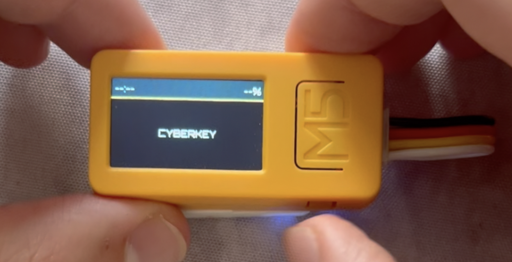
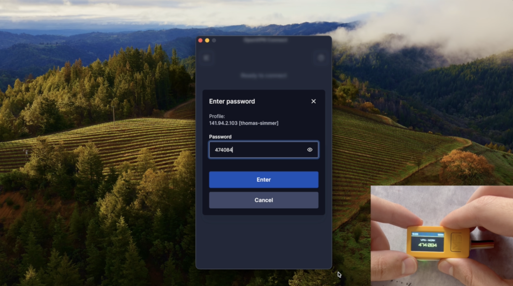

# CyberKey

[](https://github.com/thomassimmer/cyberkey/actions/workflows/ci.yml)
[](LICENSE)

Touch an enrolled finger. A TOTP code is typed into the focused field over Bluetooth — no phone, no app, no copy-paste.

Built on the **M5StickC Plus 2** (ESP32). Pairs with macOS, Windows, and Linux as a standard BLE HID keyboard.

## Demo video

[](https://youtu.be/Q93ilcUGO0s)

## Pictures

<p align="center">


</p>


---

## How it works

```
┌──────────────────────────────────────────────┐
│             M5StickC Plus 2                  │
│                                              │
│  Fingerprint sensor  ──→  match slot N       │
│  NVS (AES-256-XTS)   ──→  load secret[N]     │
│  RTC (BM8563)        ──→  current timestamp  │
│                           ↓                  │
│                        TOTP code             │
│                           ↓                  │
│  NimBLE HID keyboard ──→  broadcast          │
└──────────────────────────────────────────────┘
          │ BLE             │               │
          ▼                 ▼               ▼
    Host computer 1   Host computer 2   Host computer 3
```

One finger = one service. Place the enrolled finger, the device matches it, generates the 6-digit code, and types it via BLE. Wrong finger → red LED, nothing typed.

Configuration (enrollment, clock sync, bond management) happens over USB-C serial using the `cyberkey-cli` desktop tool.

---

## User Interface & Shortcuts

### During Normal Use
| Action | Button | Effect |
|--------|--------|--------|
| **TOTP** | Sensor | Place an enrolled finger — the service label and 6-digit code appear on the display, then the code is typed via BLE. |
| **Pairing** | **Button B** (short) | Toggle the BLE pairing window (displays the PIN). |
| **Clear Bonds** | **Button A** (1.5s) | Resets all Bluetooth pairings (hold again to confirm). |
| **Power Off** | **Button C** | Any press cuts power via GPIO. BLE bonds are preserved; the device reconnects automatically on next boot. |

### Recovery (at Boot)
| Action | Button | Effect |
|--------|--------|--------|
| **Factory Reset** | **Button A** (hold 2s, press again within 10s) | Erases all fingerprints and stored secrets. |

---

## Hardware

| Part | Reference |
|------|-----------|
| M5StickC Plus 2 | [M5Stack SKU:K016-P2](https://shop.m5stack.com/products/m5stickc-plus2-esp32-mini-iot-development-kit) |
| Fingerprint sensor | [M5Stack Unit Fingerprint2 SKU:U203](https://shop.m5stack.com/products/fingerprint-2-unit-a-k323cp) |

The sensor connects to the M5StickC Plus 2 Grove port (UART, no soldering).


---

## Security model

**BLE pairing** uses LESC (ECDH P-256) + MITM passkey entry. A random 6-digit passkey is generated at boot and displayed on the LCD. The host must enter it to complete pairing — a rogue device nearby cannot pair silently.

**Storage** uses ESP-IDF encrypted NVS (AES-256-XTS). The encryption key is generated at first boot and burned into the ESP32's eFuses (one-time programmable, cannot be read back). A stolen device with a dumped flash image yields only ciphertext.

**Authentication** gates the USB CLI behind fingerprint unlock. TOTP secrets are never sent over the wire in full.

Full details: [docs/ble-security.md](docs/ble-security.md) · [docs/storage.md](docs/storage.md)

---

## Build & flash

### Prerequisites

```sh
# Install the Xtensa toolchain (one-time)
cargo install espup
espup install
source ~/.espup/export-esp.sh
```

[`espflash`](https://github.com/esp-rs/espflash) is required to flash. It is pulled in automatically via `cargo run`.

### Firmware

```sh
cd firmware
cargo build --release        # build only
cargo run --release          # build, flash, and open serial monitor
```

### Desktop CLI

```sh
cargo build --release --package cyberkey-cli
# binary: target/release/cyberkey-cli
```

Connect the device over USB-C, then run `cyberkey-cli`. It auto-detects the serial port, syncs the clock, and shows an interactive menu.

---

## Tests

The `no_std` crates are fully testable on a standard Rust toolchain (no hardware needed):

```sh
cargo test --exclude firmware
```

The firmware crate targets Xtensa ESP32 and requires the Espressif toolchain; it is excluded from the above. See [docs/testing.md](docs/testing.md) for the manual smoke test checklist.

---

## Repository layout

| Crate | Target | Description |
|-------|--------|-------------|
| `crates/cyberkey-core` | `no_std` | TOTP engine (RFC 6238), BCD helpers |
| `crates/cyberkey-hid` | `no_std` | ASCII → HID keycode table |
| `crates/fingerprint2-rs` | `no_std` | Fingerprint2 sensor UART driver |
| `crates/cyberkey-cli` | `std` | Desktop configuration tool |
| `firmware` | ESP32 only | Hardware integration, BLE, main loop |

Architecture and design decisions: [ARCHITECTURE.md](ARCHITECTURE.md)

---

## References & Inspirations

**Cyberpunk 2077** is the primary aesthetic inspiration. CyberKey is a first attempt at making real the kind of cyberware gadgets from the game — a physical device that does something that still feels futuristic. This project was born from the desire to learn embedded systems by building something useful that doesn't exist yet.

### Prior art & reference code

- **[AirHound](https://github.com/dougborg/AirHound)** — A Rust `no_std` + ESP32 project with the same architectural pattern: a portable detection library tested on a laptop, wired to hardware in a thin firmware crate. A reference for what a well-structured ESP32/Rust workspace looks like.

- **[M5Unified](https://github.com/m5stack/M5Unified)** — M5Stack's official C++ hardware abstraction library. Used as the reference for GPIO maps, peripheral initialization order, and battery ADC calibration formula.

- **[M5Unit-Fingerprint2](https://github.com/m5stack/M5Unit-Fingerprint2)** — M5Stack's official Arduino driver for the Fingerprint2 sensor. Source of the UART packet protocol implemented from scratch in [`fingerprint2-rs`](crates/fingerprint2-rs/).

- **[Export Google Authenticator OTP keys](https://gist.github.com/mapster/4b8b9f8f6b92cc1ca58ae5506e0508f7)** — Script for extracting base32 TOTP secrets from Google Authenticator. Useful for migrating existing 2FA accounts to CyberKey.

### My own earlier experiments on this hardware

- **[m5stickc-plus-2-hello-world](https://github.com/thomassimmer/m5stickc-plus-2-hello-world)** — First exploration of the M5StickC Plus 2 in Rust, comparing bare-metal `esp-hal` vs `esp-idf-svc`. Led to the choice of ESP-IDF for CyberKey (NVS, FreeRTOS, NimBLE).

- **[m5stickc-plus-2-bluetooth-macos](https://github.com/thomassimmer/m5stickc-plus-2-bluetooth-macos)** — The prototype that cracked macOS BLE HID pairing. Documents why the pure-Rust `trouble-host` stack failed and why switching to NimBLE via `esp32-nimble` was the fix. Became the foundation for CyberKey's BLE layer.

---

## License

This project is licensed under the [MIT License](LICENSE).
